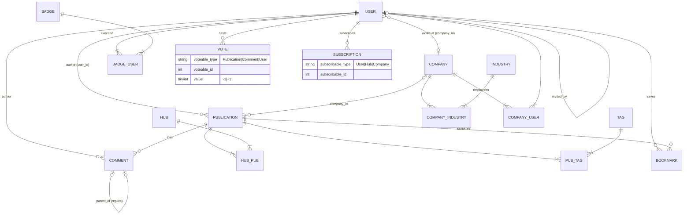

# Domain Model

A backend clone of the core [habr.com](https://habr.com) entities — publications, hubs, companies, and social activity — as a Laravel 13 JSON API.

## Entities Overview

| Entity | Table | Purpose |
|---|---|---|
| **User** | `users` | Author. Unique login (used instead of email in URLs), name, bio, avatar, karma, rating, location, employer, inviter |
| **Company** | `companies` | Corporate blog. Slug, description, rating, subscribers, website, headcount, founding date |
| **Industry** | `industries` | Company industry ("Domains & Hosting", "Fintech"…) |
| **Hub** | `hubs` | Thematic hub. Unique alias, name, description, rating, subscriber counter |
| **Publication** | `publications` | Single entity for article/post/news (`type`). Status (`draft/sandbox/published`), difficulty, label, translation flags, cached counters |
| **Tag** | `tags` | Free-form publication tags. Created on the fly via `firstOrCreate` by name |
| **Comment** | `comments` | Publication comment. A tree via `parent_id` (self-reference) |
| **Vote** | `votes` | ±1 vote on a publication, a comment, or a user's karma (**morph** `voteable`) |
| **Bookmark** | `bookmarks` | User's saved publication |
| **Subscription** | `subscriptions` | Follow of a user, hub, or company (**morph** `subscribable`) |
| **Badge** | `badges` | Achievement badge ("Legend", "Veteran"...). Granted through the `badge_user` pivot |

## ER Diagram



### Polymorphic Relations (morph)

- **`votes.voteable`** → `Publication` / `Comment` / `User`.
  Voting on publications and comments recalculates their rating; voting on a user changes their **karma**.
- **`subscriptions.subscribable`** → `User` / `Hub` / `Company`.
  Hubs and Companies maintain a denormalized `subscribers_count`; a user's follower count is computed by query.

Uniqueness: one vote per user per target; one subscription/bookmark per object.

## Enums

All enumerations live in `app/Enums/` and are cast in models:

| Enum | Values | Russian labels (as shown in the Habr UI) |
|---|---|---|
| `PublicationType` | `article`, `post`, `news` | Статья, Пост, Новость |
| `PublicationStatus` | `draft`, `sandbox`, `published` | — |
| `Difficulty` | `easy`, `medium`, `hard` | Простой, Средний, Сложный |
| `PublicationLabel` | `tutorial`, `case`, `analytics`, `opinion`, `review`, `digest`, `retrospective`, `roadmap` | Туториал, Кейс, Аналитика, Мнение, Обзор, Дайджест, Ретроспектива, Роадмэп |
| `VoteSubject` | `publications`, `comments`, `users` | — (vote routing) |
| `SubscribableType` | `user`, `hub`, `company` | — |

## Business Rules

### Publication Lifecycle

```
POST /api/publications
   │  status=draft (default) or status=sandbox
   ▼
┌───────┐   POST /api/publications/{id}/publish   ┌───────────┐
│ draft │ ───────────────────────────────────────►│ published │──► visible everywhere
└───────┘                                         └───────────┘
    ▲
    │ status=sandbox on creation
┌─────────┐
│ sandbox │  publicly listed via GET /api/publications?status=sandbox
└─────────┘
```

- **draft** — only the author can see it (everyone else gets `404`);
- **sandbox** — Habr's "Sandbox": publicly listed separately, excluded from the main feed;
- **published** — goes live with `published_at = now()`; calling `publish` again never resets the date;
- only the author may edit/delete (`PublicationPolicy`); `type` is immutable after creation.

### Voting

Endpoints: `POST .../vote` for publications and comments, `POST /api/users/{id}/karma`. Body: `{"value": 1}` or `{"value": -1}`.

Behavior when the same user votes again (`VoteService`):

| Situation | Action | Target's rating change |
|---|---|---|
| No vote yet | created | `±value` |
| Same value | removed | `-value` |
| Opposite value | switched | `±2·value` |

- Publication: recalculates `rating = votes_up − votes_down`, `votes_up`, `votes_down`;
- Comment: recalculates `rating` (sum of values);
- User: `karma += delta`.

### Denormalized Counters

Ratings, `comments_count`, `bookmarks_count`, `subscribers_count` are stored directly on tables and updated by services/controllers when data changes. This lets feeds sort by rating without joining the votes table.

### Personal Feed (`feed_settings`)

Per-user settings are stored in a JSON column (`PUT /api/profile`):

```json
{
  "types": ["article", "post"],
  "difficulties": ["easy", "medium"],
  "min_rating": 10
}
```

Precedence: query parameters override stored settings. If the user subscribes to any hubs or authors, the feed is limited to them (disable with `global=1`).

### Invites

`users.invited_by` — self-referencing FK: an invite chain ("who invited whom"; registration on Habr was invite-only).
