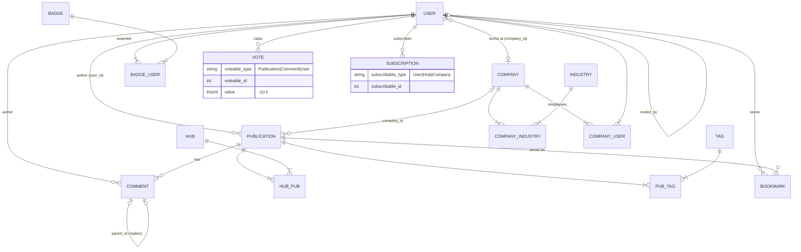

# Доменная модель

Бэкенд-клон ключевых сущностей [habr.com](https://habr.com): публикации, хабы, компании и социальная активность — как JSON API на Laravel 13.

## Обзор сущностей

| Сущность | Таблица | Назначение |
|---|---|---|
| **User** | `users` | Автор. Уникальный login (используется вместо email в URL), имя, биография, аватар, карма, рейтинг, локация, работодатель, пригласивший |
| **Company** | `companies` | Корпоративный блог. Slug, описание, рейтинг, подписчики, сайт, размер, дата основания |
| **Industry** | `industries` | Отрасль компании («Domains & Hosting», «Fintech»…) |
| **Hub** | `hubs` | Тематический хаб. Уникальный alias, название, описание, рейтинг, счётчик подписчиков |
| **Publication** | `publications` | Единая сущность для article/post/news (`type`). Статус (`draft/sandbox/published`), сложность, метка, флаги переводов, кэшируемые счётчики |
| **Tag** | `tags` | Произвольные теги публикации. Создаются на лету через `firstOrCreate` по имени |
| **Comment** | `comments` | Комментарий к публикации. Дерево через `parent_id` (самоссылка) |
| **Vote** | `votes` | Голос ±1 за публикацию, комментарий или карму пользователя (**morph** `voteable`) |
| **Bookmark** | `bookmarks` | Сохранённая публикация пользователя |
| **Subscription** | `subscriptions` | Подписка на пользователя, хаб или компанию (**morph** `subscribable`) |
| **Badge** | `badges` | Нагрудный знак («Легенда», «Ветеран»…). Выдача через pivot `badge_user` |

## ER-диаграмма



### Полиморфные отношения (morph)

- **`votes.voteable`** → `Publication` / `Comment` / `User`.
  Голоса за публикации и комментарии пересчитывают их рейтинг; голос за пользователя меняет его **карму**.
- **`subscriptions.subscribable`** → `User` / `Hub` / `Company`.
  У хабов и компаний денормализованный `subscribers_count`; число подписчиков пользователя считается запросом.

Уникальность: один голос на пользователя на цель; одна подписка/закладка на объект.

## Енамы

Все перечисления живут в `app/Enums/` и кастятся в моделях:

| Енам | Значения | Русские метки (UI habr) |
|---|---|---|
| `PublicationType` | `article`, `post`, `news` | Статья, Пост, Новость |
| `PublicationStatus` | `draft`, `sandbox`, `published` | — |
| `Difficulty` | `easy`, `medium`, `hard` | Простой, Средний, Сложный |
| `PublicationLabel` | `tutorial`, `case`, `analytics`, `opinion`, `review`, `digest`, `retrospective`, `roadmap` | Туториал, Кейс, Аналитика, Мнение, Обзор, Дайджест, Ретроспектива, Роадмэп |
| `VoteSubject` | `publications`, `comments`, `users` | — (маршрутизация голосов) |
| `SubscribableType` | `user`, `hub`, `company` | — |

## Бизнес-правила

### Жизненный цикл публикации

```
POST /api/publications
   │  status=draft (по умолчанию) или status=sandbox
   ▼
┌───────┐   POST /api/publications/{id}/publish   ┌───────────┐
│ draft │ ───────────────────────────────────────►│ published │──► виден везде
└───────┘                                         └───────────┘
    ▲
    │ status=sandbox при создании
┌─────────┐
│ sandbox │  публично через GET /api/publications?status=sandbox
└─────────┘
```

- **draft** — видит только автор (всем остальным `404`);
- **sandbox** — «Песочница» habr: публично в отдельном списке, из основной ленты исключён;
- **published** — выход в свет с `published_at = now()`; повторный `publish` дату не сбрасывает;
- менять/удалять может только автор (`PublicationPolicy`); `type` неизменен после создания.

### Голосование

Эндпоинты: `POST .../vote` для публикаций и комментариев, `POST /api/users/{id}/karma`. Тело: `{"value": 1}` или `{"value": -1}`.

Поведение при повторном голосе того же пользователя (`VoteService`):

| Ситуация | Действие | Изменение рейтинга цели |
|---|---|---|
| Голоса ещё не было | создаётся | `±value` |
| То же значение | удаляется | `-value` |
| Противоположное значение | переключается | `±2·value` |

- Публикация: пересчитывается `rating = votes_up − votes_down`, `votes_up`, `votes_down`;
- Комментарий: пересчитывается `rating` (сумма значений);
- Пользователь: `karma += delta`.

### Денормализованные счётчики

Рейтинги, `comments_count`, `bookmarks_count`, `subscribers_count` хранятся прямо в таблицах и обновляются сервисами/контроллерами при изменении данных. Это позволяет сортировать ленту по рейтингу без join'а к таблице голосов.

### Персональная лента (`feed_settings`)

Настройки на пользователя хранятся в JSON-колонке (`PUT /api/profile`):

```json
{
  "types": ["article", "post"],
  "difficulties": ["easy", "medium"],
  "min_rating": 10
}
```

Приоритет: query-параметры перекрывают сохранённые настройки. Если пользователь подписан на хабы или авторов, лента ограничивается ими (отключить — `global=1`).

### Приглашения

`users.invited_by` — self-ссылка: цепочка приглашений («кто кого пригласил»; регистрация на habr была по инвайтам).